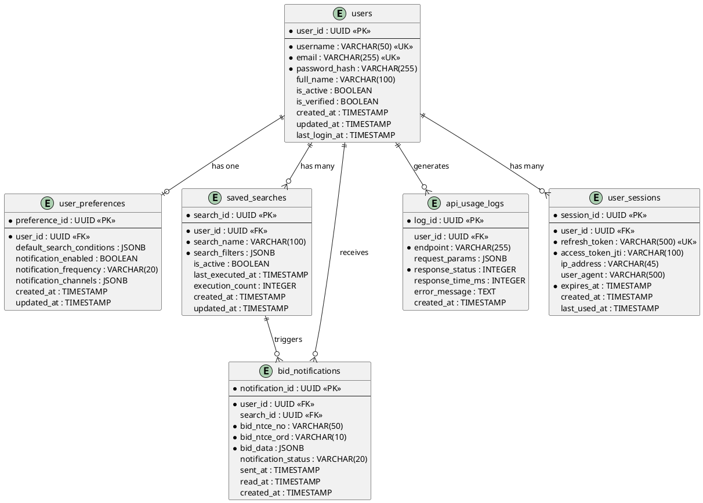

# 데이터베이스 스키마 설계

## 개요
나라장터 입찰공고 검색 시스템의 다중 사용자 지원을 위한 데이터베이스 스키마입니다.

## 구현 방식
- **ORM**: SQLModel (FastAPI와의 완벽한 통합)
- **데이터베이스**: PostgreSQL (프로덕션) / SQLite (개발)
- **비동기 처리**: asyncpg, aiosqlite

## 테이블 설계

### 1. users (사용자)
사용자 계정 정보를 저장합니다.

| 필드명 | 데이터 타입 | 제약 조건 | 설명 |
|--------|------------|----------|------|
| user_id | UUID | PRIMARY KEY | 사용자 고유 식별자 |
| username | VARCHAR(50) | UNIQUE, NOT NULL | 사용자명 (로그인 ID) |
| email | VARCHAR(255) | UNIQUE, NOT NULL | 이메일 주소 |
| password_hash | VARCHAR(255) | NOT NULL | 암호화된 비밀번호 (bcrypt) |
| full_name | VARCHAR(100) | NULL | 사용자 실명 |
| is_active | BOOLEAN | DEFAULT TRUE | 계정 활성화 여부 |
| is_verified | BOOLEAN | DEFAULT FALSE | 이메일 인증 여부 |
| created_at | TIMESTAMP | DEFAULT NOW() | 계정 생성 일시 |
| updated_at | TIMESTAMP | DEFAULT NOW() | 최종 수정 일시 |
| last_login_at | TIMESTAMP | NULL | 마지막 로그인 일시 |

**인덱스:**
- `idx_users_username` ON username
- `idx_users_email` ON email

### 2. user_preferences (사용자 선호 설정)
사용자별 기본 검색 조건 및 알림 설정을 저장합니다.

| 필드명 | 데이터 타입 | 제약 조건 | 설명 |
|--------|------------|----------|------|
| preference_id | UUID | PRIMARY KEY | 선호 설정 고유 식별자 |
| user_id | UUID | FOREIGN KEY, NOT NULL | 사용자 ID (users.user_id) |
| default_search_conditions | JSONB | NULL | 기본 검색 조건 |
| notification_enabled | BOOLEAN | DEFAULT TRUE | 알림 수신 여부 |
| notification_frequency | VARCHAR(20) | DEFAULT 'daily' | 알림 빈도 (realtime/daily/weekly) |
| notification_channels | JSONB | NULL | 알림 채널 설정 (email, sms 등) |
| created_at | TIMESTAMP | DEFAULT NOW() | 생성 일시 |
| updated_at | TIMESTAMP | DEFAULT NOW() | 최종 수정 일시 |

**default_search_conditions JSON 구조:**
```json
{
  "inqryDiv": "1",
  "prtcptLmtRgnCd": "11",
  "presmptPrceBgn": 100000000,
  "presmptPrceEnd": 1000000000,
  "dateRange": {
    "start": "202501010000",
    "end": "202512312359"
  }
}
```

**인덱스:**
- `idx_user_preferences_user_id` ON user_id (UNIQUE)

### 3. saved_searches (저장된 검색)
사용자가 저장한 검색 조건들을 관리합니다.

| 필드명 | 데이터 타입 | 제약 조건 | 설명 |
|--------|------------|----------|------|
| search_id | UUID | PRIMARY KEY | 저장된 검색 고유 식별자 |
| user_id | UUID | FOREIGN KEY, NOT NULL | 사용자 ID (users.user_id) |
| search_name | VARCHAR(100) | NOT NULL | 검색 이름 (사용자 지정) |
| search_filters | JSONB | NOT NULL | 검색 필터 조건 |
| is_active | BOOLEAN | DEFAULT TRUE | 활성화 여부 |
| last_executed_at | TIMESTAMP | NULL | 마지막 실행 일시 |
| execution_count | INTEGER | DEFAULT 0 | 실행 횟수 |
| created_at | TIMESTAMP | DEFAULT NOW() | 생성 일시 |
| updated_at | TIMESTAMP | DEFAULT NOW() | 최종 수정 일시 |

**search_filters JSON 구조:**
```json
{
  "inqryDiv": "1",
  "inqryBgnDt": "202501010000",
  "inqryEndDt": "202501312359",
  "prtcptLmtRgnCd": "11",
  "presmptPrceBgn": 100000000,
  "presmptPrceEnd": 500000000,
  "bidNtceNm": "도로공사",
  "ntceInsttNm": "서울시"
}
```

**인덱스:**
- `idx_saved_searches_user_id` ON user_id
- `idx_saved_searches_active` ON is_active

### 4. bid_notifications (입찰 알림)
사용자에게 전송된 입찰 공고 알림 이력을 저장합니다.

| 필드명 | 데이터 타입 | 제약 조건 | 설명 |
|--------|------------|----------|------|
| notification_id | UUID | PRIMARY KEY | 알림 고유 식별자 |
| user_id | UUID | FOREIGN KEY, NOT NULL | 사용자 ID (users.user_id) |
| search_id | UUID | FOREIGN KEY, NULL | 저장된 검색 ID (saved_searches.search_id) |
| bid_ntce_no | VARCHAR(50) | NOT NULL | 입찰공고번호 |
| bid_ntce_ord | VARCHAR(10) | NOT NULL | 입찰공고차수 |
| bid_data | JSONB | NOT NULL | 입찰 공고 상세 데이터 |
| notification_status | VARCHAR(20) | DEFAULT 'pending' | 알림 상태 (pending/sent/failed) |
| sent_at | TIMESTAMP | NULL | 발송 일시 |
| read_at | TIMESTAMP | NULL | 읽음 일시 |
| created_at | TIMESTAMP | DEFAULT NOW() | 생성 일시 |

**인덱스:**
- `idx_bid_notifications_user_id` ON user_id
- `idx_bid_notifications_status` ON notification_status
- `idx_bid_notifications_bid_ntce` ON (bid_ntce_no, bid_ntce_ord)

### 5. api_usage_logs (API 사용 로그)
공공데이터포털 API 호출 이력을 추적합니다.

| 필드명 | 데이터 타입 | 제약 조건 | 설명 |
|--------|------------|----------|------|
| log_id | UUID | PRIMARY KEY | 로그 고유 식별자 |
| user_id | UUID | FOREIGN KEY, NULL | 사용자 ID (users.user_id) |
| endpoint | VARCHAR(255) | NOT NULL | API 엔드포인트 |
| request_params | JSONB | NULL | 요청 파라미터 |
| response_status | INTEGER | NOT NULL | HTTP 응답 코드 |
| response_time_ms | INTEGER | NULL | 응답 시간 (밀리초) |
| error_message | TEXT | NULL | 오류 메시지 |
| created_at | TIMESTAMP | DEFAULT NOW() | 호출 일시 |

**인덱스:**
- `idx_api_usage_logs_user_id` ON user_id
- `idx_api_usage_logs_created_at` ON created_at

### 6. user_sessions (사용자 세션)
JWT 토큰 기반 세션 관리를 위한 테이블입니다.

| 필드명 | 데이터 타입 | 제약 조건 | 설명 |
|--------|------------|----------|------|
| session_id | UUID | PRIMARY KEY | 세션 고유 식별자 |
| user_id | UUID | FOREIGN KEY, NOT NULL | 사용자 ID (users.user_id) |
| refresh_token | VARCHAR(500) | UNIQUE, NOT NULL | 리프레시 토큰 |
| access_token_jti | VARCHAR(100) | NOT NULL | 액세스 토큰 JTI |
| ip_address | VARCHAR(45) | NULL | 접속 IP 주소 |
| user_agent | VARCHAR(500) | NULL | 사용자 에이전트 |
| expires_at | TIMESTAMP | NOT NULL | 만료 일시 |
| created_at | TIMESTAMP | DEFAULT NOW() | 생성 일시 |
| last_used_at | TIMESTAMP | DEFAULT NOW() | 마지막 사용 일시 |

**인덱스:**
- `idx_user_sessions_user_id` ON user_id
- `idx_user_sessions_refresh_token` ON refresh_token
- `idx_user_sessions_expires_at` ON expires_at

## ER 다이어그램



## 관계 설명

### 1:1 관계
- **users ↔ user_preferences**: 각 사용자는 하나의 선호 설정을 가집니다.

### 1:N 관계
- **users → saved_searches**: 한 사용자는 여러 개의 저장된 검색을 가질 수 있습니다.
- **users → bid_notifications**: 한 사용자는 여러 개의 입찰 알림을 받을 수 있습니다.
- **users → api_usage_logs**: 한 사용자는 여러 번의 API 호출을 생성할 수 있습니다.
- **users → user_sessions**: 한 사용자는 여러 개의 활성 세션을 가질 수 있습니다.
- **saved_searches → bid_notifications**: 하나의 저장된 검색은 여러 개의 알림을 트리거할 수 있습니다.

## 데이터 무결성 규칙

### CASCADE 규칙
- `user_preferences.user_id` → `users.user_id`: ON DELETE CASCADE
- `saved_searches.user_id` → `users.user_id`: ON DELETE CASCADE
- `bid_notifications.user_id` → `users.user_id`: ON DELETE CASCADE
- `user_sessions.user_id` → `users.user_id`: ON DELETE CASCADE

### SET NULL 규칙
- `bid_notifications.search_id` → `saved_searches.search_id`: ON DELETE SET NULL
- `api_usage_logs.user_id` → `users.user_id`: ON DELETE SET NULL

## 보안 고려사항

1. **비밀번호 저장**
   - bcrypt 해시 알고리즘 사용 (cost factor: 12)
   - 절대 평문 비밀번호 저장 금지

2. **토큰 관리**
   - JWT 액세스 토큰: 15분 유효기간
   - 리프레시 토큰: 7일 유효기간
   - 토큰 블랙리스트 관리 (로그아웃 시)

3. **민감 정보 암호화**
   - 이메일 주소: 인덱스를 위해 평문 저장, 하지만 HTTPS 전송
   - API 키: 환경 변수로 관리, DB 저장 금지

4. **접근 제어**
   - Row-Level Security (RLS) 적용
   - 사용자는 자신의 데이터만 조회/수정 가능

## 성능 최적화

1. **인덱스 전략**
   - 자주 조회되는 컬럼에 인덱스 생성
   - JSONB 컬럼에 GIN 인덱스 적용 (검색 조건)

2. **파티셔닝**
   - `api_usage_logs`: 월별 파티셔닝 (시계열 데이터)
   - `bid_notifications`: 분기별 파티셔닝

3. **캐싱**
   - Redis를 활용한 사용자 세션 캐싱
   - 자주 조회되는 검색 결과 캐싱 (5분 TTL)

## 마이그레이션 전략

1. **초기 마이그레이션**
   - Alembic을 사용한 버전 관리
   - 스키마 변경 이력 추적

2. **데이터 백업**
   - 일일 자동 백업 (PostgreSQL pg_dump)
   - 주간 전체 백업 + 일일 증분 백업

3. **롤백 계획**
   - 각 마이그레이션에 대한 다운그레이드 스크립트 준비
   - 프로덕션 배포 전 스테이징 환경 테스트

## 확장 가능성

### 향후 추가 가능한 테이블

1. **user_favorites**: 즐겨찾기 입찰 공고
2. **bid_history**: 사용자의 투찰 이력
3. **user_documents**: 사용자가 업로드한 서류 관리
4. **notification_templates**: 알림 템플릿 관리
5. **audit_logs**: 시스템 감사 로그

### 샤딩 전략 (대규모 확장 시)
- 사용자 ID 기반 수평 샤딩
- 지역별 데이터베이스 분리 (prtcptLmtRgnCd 기준)

## 참고사항

- 모든 TIMESTAMP는 UTC 기준으로 저장
- JSONB 타입은 PostgreSQL 전용 (SQLite는 TEXT로 대체)
- UUID v4 사용 (보안 및 분산 시스템 고려)