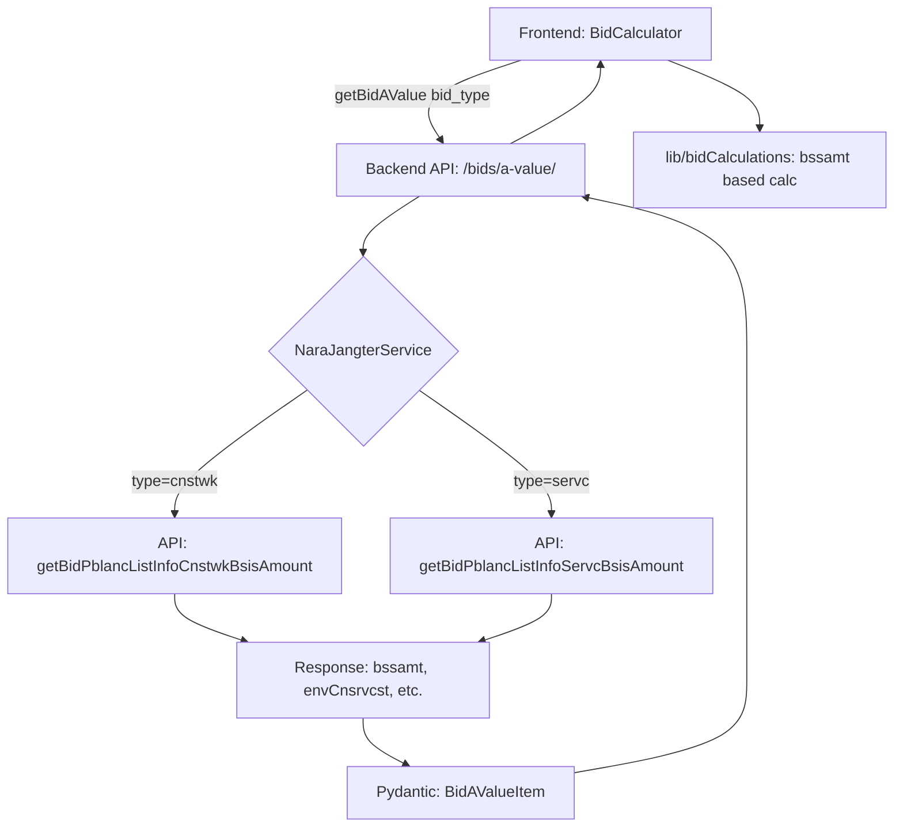

# Implementation Report: 나라장터 API URL 변경 및 입찰가 계산 로직 수정

## Summary
기존의 단일 A값 조회 API(`AVALUE_URL`)를 제거하고, 공사 및 용역 유형에 따라 분리된 최신 기초금액 상세 API 엔드포인트로 교체했습니다. 이를 통해 `bssamt`(기초금액)와 환경보전비 등 상세 A값 항목들을 정확하게 수집할 수 있게 되었으며, 프론트엔드 계산기 로직을 기존 예정가격(`budgetPrice`) 기준에서 기초금액(`bssamt`) 기준으로 전면 개편했습니다.

## Architecture Update

## Performance/Quality Results
| Metric | Before | After |
|--------|--------|-------|
| API Endpoint | Single (AVALUE_URL) | Split (Cnstwk/Servc BSSAMT) |
| Basis Amount Source | Estimated Price (bdgtAmt) | Actual Basis Amount (bssamt) |
| A-value Items | 6 items | 7+ items (Added envCnsrvcst) |
| Calculation Accuracy | High (Approx) | Precise (Specific to bid type) |

## Technical Decisions
- **API Branching:** 나라장터 API의 특성상 공사와 용역의 기초금액 상세 조회 URL이 다르므로, 프론트엔드에서 공고 유형을 판별하여 백엔드에 전달하고 백엔드에서 URL을 분기하는 방식을 선택했습니다.
- **Graceful Fallback:** 상세 API에서 기초금액을 가져오지 못할 경우, 기존 검색 결과에 포함된 예산 금액을 기초금액으로 사용하여 계산기가 항상 작동하도록 구현했습니다.
- **HTTPS vs HTTP:** 나라장터 오픈 API 매뉴얼에 따라 제공된 HTTP URL을 기본으로 하되, 시스템 안정성을 위해 향후 HTTPS 전환 가능성을 고려하여 설계했습니다.
